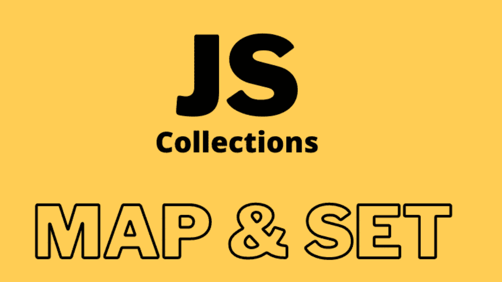

# Coleções Chaveadas 🔗

Este repositório contém uma desafio "Coleções Chaveadas".

## Proposta de Desafio 01: Maps.

Crie uma função que retorna o nome dos membros de um Map que tem o papel 'ADMIN' no sistema.

1. Crie uma função `getAdmins` que recebe um `Map`;
2. Crie um Map e popule-o com nomes de usuários e seus papeis no sistema. (Ex: 'Luiz' => 'Admin');
3. Dentro de `getAdmins`, utilize o loop `for...of` para retornar uma lista com os nomes dos usu;arios que são administradores.

## Proposta de Desafio 02: Sets.

Dado o array `[30, 30, 40, 5, 223, 2049, 3034, 5]`, retorne outro array apenas com valores únicos.

   

